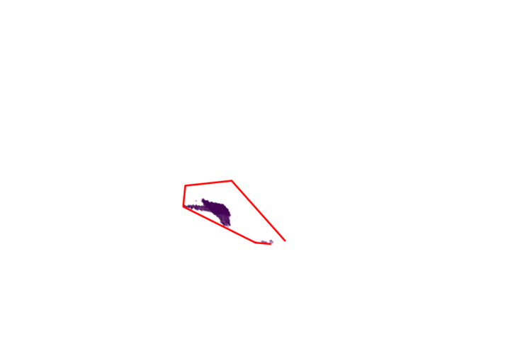

# Human Detection with the use of Neural Network

The work of a one-month internship. Goal was to detect the human with only the distance (in mm f.e) to a camera.

---
## Table of contents
* [Initial Situation](#initial-situation)
* [Intermediate Solution](#intermediate-solution)
* [Convex Hull](#convex-hull)
* [Summary](#summary)

---
## Initial Situaion
Initial Situation was:

where the dark area should represent the moving human.

---
## Intermediate Solution
The goal was now to extract the background to only represent the human and keep track of him. After several approaches the outcome was:

---
## Convex Hull
As seen few points get picked falsely but nevertheless the outcome was pretty pleasant. Lastly I tried to detect the human using a convex hull:

---
## Summary
Because a few points were picked falsely in the intermediate solution the convex hull did not work perfecty. Because of the short time I had on this project this was the last result.
